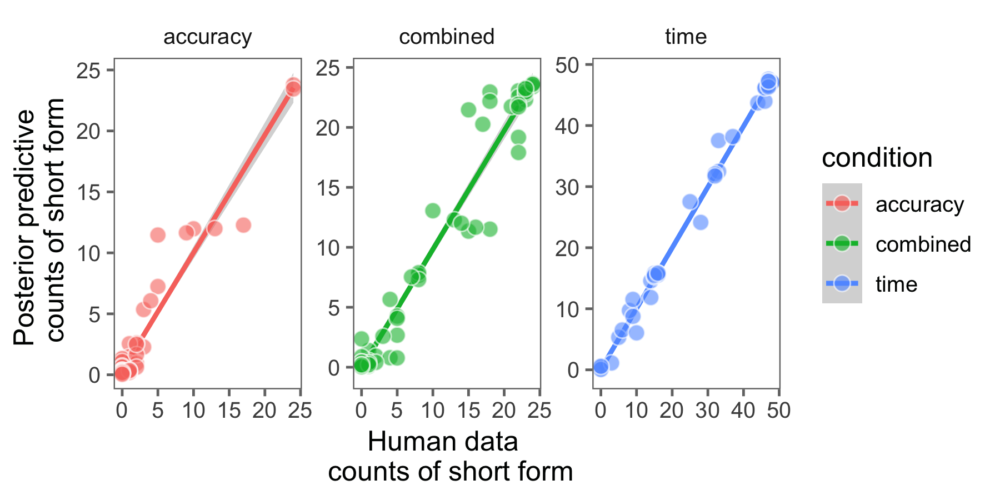

# Modeling Kanwall et al. 2017

Kanwal et al. (2017) conduct an experimental study of Zipf's Law of Abbreviation in an artificial langauge learning paradigm.

Results indicate that Zipfian speaker- and listener-pressures are necessary to derive Law of Abbreviation.

Authors highlight that these results are consistent with a pragmatic-langauge use account, but that the current
paradigm cannot distinguish between these accounts. 

We explore the second account conducting a Bayesian data analysis, representating study participants as rational and pragmatic using the
Rational Speech Act framework (RSA) of Frank & Goodman (2012). Inferring participant-level parameters we find close
fit between model posterior-predictives and the experimental data (overall r^2=0.98).

 {#fig:description}